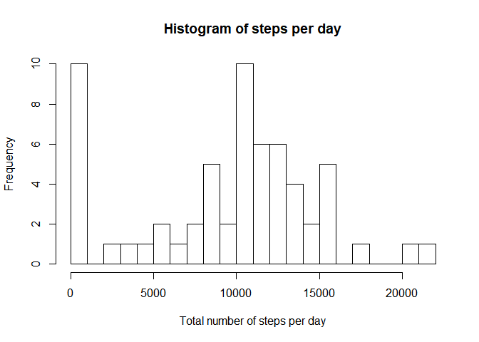

## Loading and preprocessing the data

Read data and summarise:

```r
download.file("https://d396qusza40orc.cloudfront.net/repdata%2Fdata%2Factivity.zip",
              "C:/Users/dKd/Documents/R files/Coursera/Course 5 - Reproducible Research/activity.zip")
unzip("C:/Users/dKd/Documents/R files/Coursera/Course 5 - Reproducible Research/activity.zip")
data <- read.csv("C:/Users/dKd/Documents/R files/Coursera/Course 5 - Reproducible Research/activity.csv")
summary(data)
```

```
##      steps                date          interval     
##  Min.   :  0.00   2012-10-01:  288   Min.   :   0.0  
##  1st Qu.:  0.00   2012-10-02:  288   1st Qu.: 588.8  
##  Median :  0.00   2012-10-03:  288   Median :1177.5  
##  Mean   : 37.38   2012-10-04:  288   Mean   :1177.5  
##  3rd Qu.: 12.00   2012-10-05:  288   3rd Qu.:1766.2  
##  Max.   :806.00   2012-10-06:  288   Max.   :2355.0  
##  NA's   :2304     (Other)   :15840
```

```r
# No further preprocessing necessary at this point
```

## What is mean total number of steps taken per day?
The following histogram shows how often a particular total number of steps per day was taken:

```r
library(dplyr)
hd <- data %>% 
  group_by(date) %>%
  summarise(sum = sum(steps,na.rm=T))
hist(hd$sum,breaks=20,main='Histogram of steps per day',xlab='Total number of steps per day')
```

<!-- -->

The mean and median total number of steps per day are

```
## mean = 9354.23
```

```
## 
## median = 10395
```

## What is the average daily activity pattern?

```r
hd2 <- data %>% 
  group_by(interval) %>%
  summarise(mean = mean(steps,na.rm=T))
plot(hd2$mean,type="l",main='Average daily pattern of steps',xlab='5-minute interval',ylab='number of steps')
```

<!-- -->

```r
library(nnet)
row <- which.is.max(hd2$mean)
maxsteps <- formatC(hd2$mean[row],format="f",digits=2)
maxint <- hd2$interval[row]
tim5min <- paste0(substr(maxint,1,nchar(maxint)-2),":",substring(maxint,nchar(maxint)-1)," hrs")
```
Maximum average number of steps is 206.17 at the 104-th 5-minute interval ending at 8:35 hrs.


## Imputing missing values  erewre   
There are 2304 missing data values in the dataset

```r
# if #steps is missing, impute average value of corresponding interval (from hd2)
data_imp <- left_join(data,hd2,by="interval") %>% mutate(steps=ifelse(is.na(steps),mean,steps)) %>% select(-mean)
hd_imp <- data_imp %>% 
  group_by(date) %>%
  summarise(sum = sum(steps,na.rm=T))
hist(hd_imp$sum,breaks=20,main='Histogram of steps per day after imputation',xlab='Total number of steps per day')
```

<!-- -->

The mean and median total number of steps per day after imputation are

```
## mean = 10766.19
```

```
## 
## median = 10766.19
```
Median and mean are higher than before imputation.
Median and mean are equal, because missing values are concentrated in 8 dates, in which the #steps is entirely missing. Imputation causes all of these days to get the average number of steps per day of the other days, thereby leaving the mean unchanged. The median is equal to the value of one of these days.

## Are there differences in activity patterns between weekdays and weekends?

```r
library(lubridate)
library(lattice)
data$daytype <- ifelse(wday(data$date) %in% c(1,7),"weekend","weekday")
hd3 <- data %>% 
  group_by(daytype,interval) %>%
  summarise(mean = mean(steps,na.rm=T))
comb <- xyplot(hd3$mean~hd3$interval|hd3$daytype, type="l",
   main="Pattern of steps during the day",
   ylab="#steps per interval", xlab="5-minute interval")
update(comb, layout=c(1,2))
```

<!-- -->
